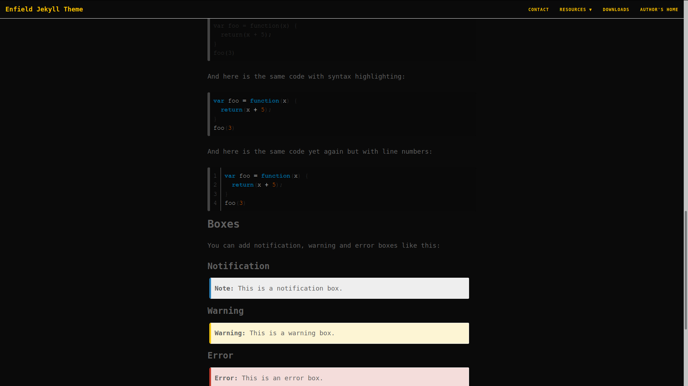
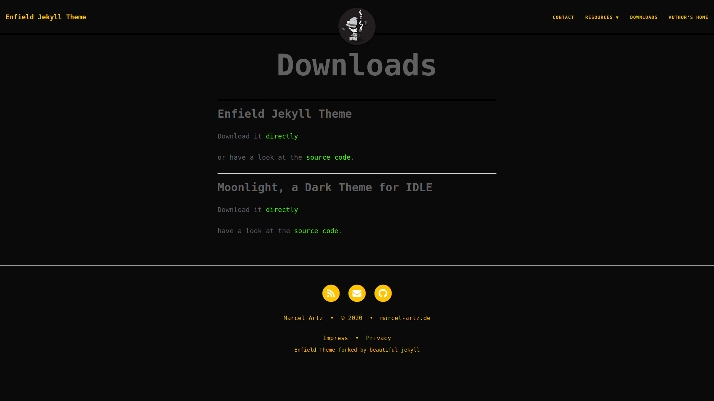

# Enfield Jekyll Theme

> *Copyright 2020 [Marcel Artz](https://marcel-artz.de)*


Enfield Jekyll Theme is a gem based dark theme for Jekyll sites. It is forked from [beatiful-jekyll](https://deanattali.com/beautiful-jekyll/) but instead
of expanding the theme's feature set, Enfield actually removes a bit of the feature set:
- removing google fonts
- removing google analytics
- removing google tagmanager
- removing disqus comments
- removing facebook comments
- disabling social shares by default
- the gem jekyll-github
- removing the light theme

But don't worry, it adds new features, too:
- adding only gem plugins that are eventually used
- adding the dark theme (based on [material desgin](https://material.io/))
- adding page for impress and privacy statement
- enhancing the way how images are presented
- adding a new color scheme for syntax highlighting 
- adding a 'related posts' section at the bottom of each post


## Installation 
> *not for GitHub Pages!*

Add this line to your Jekyll site's `Gemfile`:

```ruby
gem "enfield-jekyll-theme"
```

And add this line to your Jekyll site's `_config.yml`:

```yaml
theme: enfield-jekyll-theme
```

And then execute:

    $ bundle

Or install it yourself as:

    $ gem install enfield-jekyll-theme
    

---
> *for GitHub Pages*

https://help.github.com/en/github/working-with-github-pages/adding-a-theme-to-your-github-pages-site-using-jekyll#adding-a-jekyll-theme-in-your-sites-_configyml-file


## Contributing

Bug reports and pull requests are welcome on GitHub at https://github.com/ma744/Enfield. This project is intended to be a safe, welcoming space for collaboration, and contributors are expected to adhere to the [Contributor Covenant](http://contributor-covenant.org) code of conduct.

## Development

To set up your environment to develop this theme, run `bundle install`.

Your theme is setup just like a normal Jekyll site! To test your theme, run `bundle exec jekyll serve` and open your browser at `http://localhost:4000`. This starts a Jekyll server using your theme. Add pages, documents, data, etc. like normal to test your theme's contents. As you make modifications to your theme and to your content, your site will regenerate and you should see the changes in the browser after a refresh, just like normal.

When your theme is released, only the files in `_layouts`, `_includes`, `_sass` and `assets` tracked with Git will be bundled.
To add a custom directory to your theme-gem, please edit the regexp in `enfield-jekyll-theme.gemspec` accordingly.

## Features 

The Enfield Jekyll Theme supports some Jekyll plugins by default. 
Most of them can be enabled / disabled or modified in the _config.yml 
file without the need of touching the code. 

Please have a look at [Beatiful Jekyll's readme](https://github.com/daattali/beautiful-jekyll#readme) for more information on existing features that
are not mentioned in this readme in order to avoid redundant informations.

### SEO support 
setting customized canonical urls

### @-mention support 

https://github.com/jekyll/jekyll-mentions

### GitHub Gist support 

https://github.com/jekyll/jekyll-gist

### Atom feed support 

https://github.com/jekyll/jekyll-feed

### Relative Links for GitHub-Pages support 

https://github.com/benbalter/jekyll-relative-links

### Jekyll Analytics 

https://github.com/hendrikschneider/jekyll-analytics

Matomo is the only supported analytics service per default.

### Jekyll Redirects

https://github.com/jekyll/jekyll-redirect-from

## License

The theme is available as open source under the terms of the [MIT License](https://opensource.org/licenses/MIT).

## More Infos about Jekyll themes

https://jekyllrb.com/docs/themes/


## Thanks
Thanks to [Dean Attali](https://deanattali.com) for creating Beatiful Jekyll. 
I have chosen to fork Beatiful Jekyll to spend less time in creating a theme for my website. The great
structure of the project itself was the main reason for me to choose Beatiful Jekyll as base theme
for my modifications. (Just to let you know: in difference to some others 
it complies with most of Jekyll's naming conventions which was quite helpful :) )

## TODO ##
- add favicon
- add theme as gem to jekyll open directory
- testing staticman comment (how does it fit to the dark theme?)
- refactor pygment_highlights.css
- add fancy file format icons to download section (I need svg that are congenial)
- refactor opg-support

## More Screenshots



